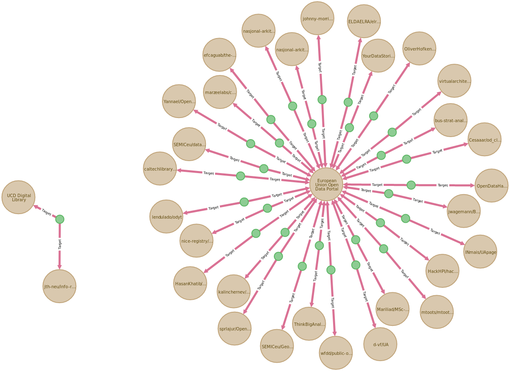

[](https://www.tidyverse.org/lifecycle/#experimental)
[](https://nsf.gov/awardsearch/showAward?AWD_ID=1928366)

# neo4j Annotation Engine

This engine is designed to run in a [`docker` container](https://www.docker.com/) for deployment portability & to facilitate reproducibility among collaborators.  The intention of this engine is to provide a platform for the credentialed crowd-sourcing of scientific records and publications without requiring underlying data resources to manage additional unstructured data.

Use cases include:

   * An early career researcher finds that a dataset in Neotoma is an outlier within a particular statistical model.  They wish to indicate this, in case others apply the same model, but do not want to (or cannot) modify the `datasetnotes` field in Neotoma.
   * A researcher finds that one of their datasets has been used in a synthesis paper, but the set of sites was cited only as `EarthChem`.  The author wishes to indicate that her paper and dataset are linked to the published synthesis.
   * The manager of a data resource finds code on the web that uses their data.  They wish to link their database to the code so that others can see how the database was used for research purposes.

Annotations should follow the [WC3 Web Annotation](https://www.w3.org/TR/annotation-model/) protocols and follow a model that supports API first development.  As such, this database is in fact composed of two distinct elements, a database, built using `neo4j`, and an API built using node/express.

This repository contains the raw code for the `neo4j` database, test data for populating the database, database scripts for the database schema and constraints, and helper cypher scripts.

## Contributions

*We welcome contributions from any individual, whether code, documentation, or issue tracking.  All participants are expected to follow the [code of conduct](https://github.com/SimonGoring/Throughput/blob/master/code_of_conduct.md) for this project.*

 * [Simon Goring](http://goring.org) - University of Wisconsin Madison

## Setting up docker

CURRENTLY UNIMPLEMENTED - Setting up Docker followed the [instructions posted by Docker](https://docs.docker.com/install/linux/docker-ce/ubuntu/) for Ubuntu.

## Using this Repository

This repository contains a bash script to initialize a Docker container that generates a neo4j instance on the end users server.

```coffeescript
> sudo bash dockrun.sh
```

There are a set of bash scripts used to initialize data within the repository.  Some of these make use of external web resources, and require the use of token files (e.g., there is the expectation of a file named `gh.token` in the `github_scraper` folder) to provide access to user tokens or password encrypted services.

## Environmental Variables

Environmental variables for database setup and for the docker container are defined in the `setup.sh` file that is included in this repository. For any security-sensitive elements we have defined the variable as `XXsensitiveXX`.  In the end-users repository these should be changed before `setup.sh` is run.  When `setup.sh` is run it includes a line in the bash script to check that these fields have been changed and to add `setup.sh` to the `.gitignore` file to ensure that the end user does not accidentally commit passwords to their own public repository.

## Annotation to Cypher Data Model

The W3C data model proposes a number of elements for annotations, including the `body`, `target`, motivations and audiences, among others.  The data model is well described in the [W3C standards](https://www.w3.org/TR/annotation-model/).  To help build the data model for the Annotation Engine we have transcribed the examples presented in the Annotation Model document into the Cypher queries that that would generate similar elements.  These examples are all named by their example numbers in the main model document, and are stored in the [cypher_anno_examples](https://github.com/throughput-ec/throughputdb/tree/master/cypher_anno_examples) folder.

These examples are preliminary, but they are developed to provide a template for the generation of the Throughput APIs.  Where the examples rely on external vocabularies, or require a set of pre-defined terms, these have been placed in the [raw_data](https://github.com/throughput-ec/throughputdb/tree/master/raw_data) folder, either as a JSON file, to be processed, or in a CQL file that can be executed to initialize the database.  A `README` in that folder provides further explanations.

## Database Schema


The database schema is modeled on the annotation standard, but uses the graph database model of nodes and relationships to constrain elements in the annotations to help improve the efficiency of queries against the data resource.

## External Data

Currently there are two sets of external data that can be added to a new instance of the database.  The first, the set of data within the [re3data resource](https://www.re3data.org/) provides us with a set of core data resources.  The second is GitHub code repositories that contain scripts that reference databases within the Re3Data database.



As the graph fills we can use progressively more powerful search tools to access data, data resources and understand connections within the annotation database.

## Loading Data Locally

A small version of the database can be accessed [here]().

To import the data into neo4j you must have the following:
* APOC must be installed locally (within the plugins folder for your neo4j installation)
  * With the installation of neo4j v4.1+ the (core) APOC plugin can be found within the `labs` folder (`/var/lib/neo4j/labs` on linux)
  * Simply copy the file from the `labs` folder to the `plugins` folder and restart the server.
  * **NOTE** If you'd like more APOC functionality you may want to get a copy from the [APOC releases page](https://github.com/neo4j-contrib/neo4j-apoc-procedures/releases).
* The neo4j configuration file (`/etc/neo4j/neo4j.conf`) must be configured to allow file imports & the use of `apoc` procedures:
  * `dbms.security.procedures.whitelist=apoc.coll.*,apoc.load.*`
  * `dbms.security.procedures.unrestricted=apoc.*`
  * `apoc.import.file.enabled=true`
